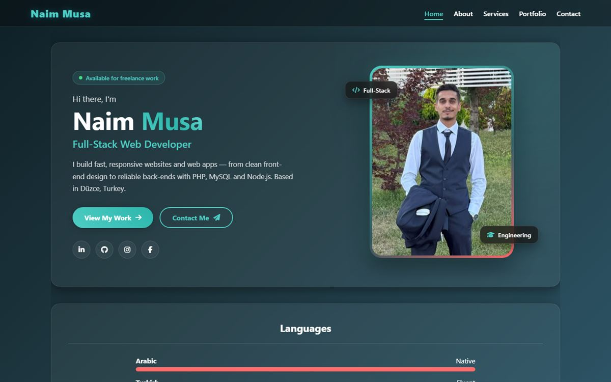
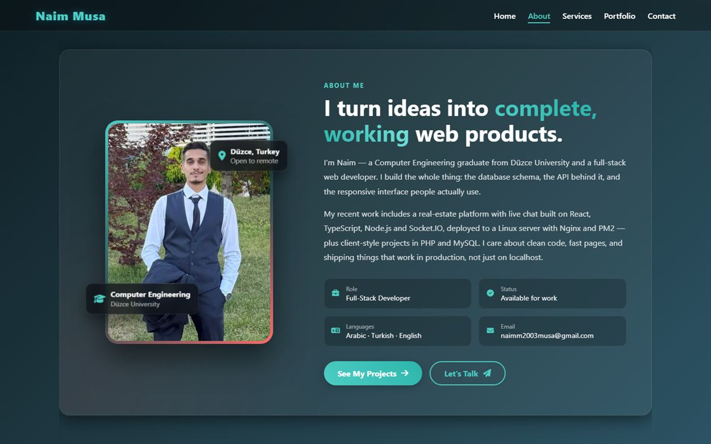
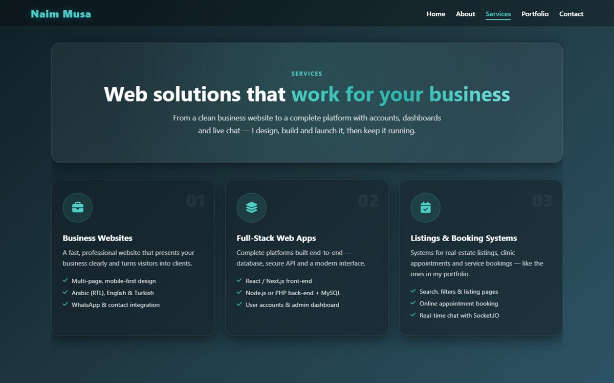
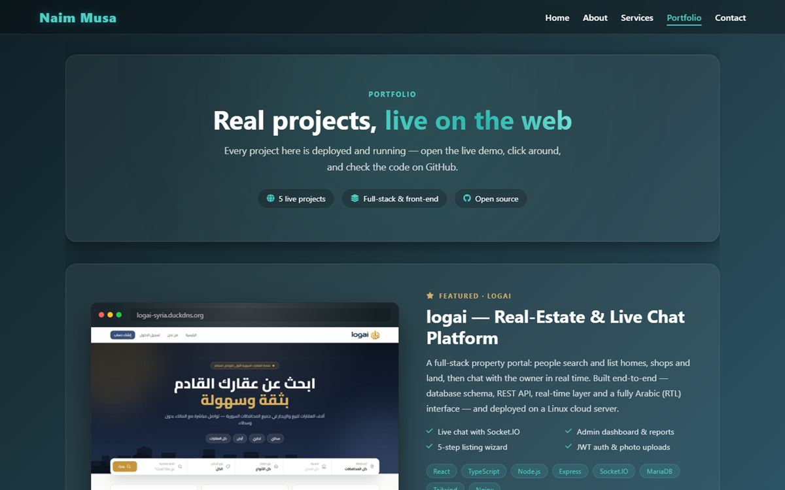
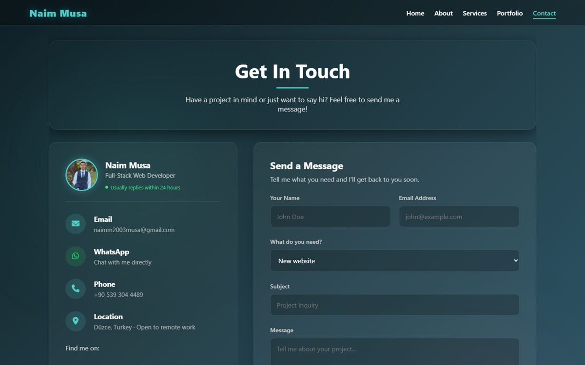

<div align="center">

# Naim Musa — Developer Portfolio

**Full-Stack Web Developer · Computer Engineering graduate, Düzce University**

A fast, hand-built portfolio site with 3D interactions, no frameworks and no build step.

[](https://naimmusaaga.github.io/My-portfolio/)
[](https://www.linkedin.com/in/naim-musaa%C4%9Fa-a05373255/)


[](LICENSE)



</div>

---

## ✨ Highlights

- **3D interactions:** cards tilt with the mouse, layers pop out in depth (`translateZ`), there's a spinning tech cube, and sections animate in with a 3D rotation as you scroll.
- **No framework:** plain HTML, CSS and vanilla JavaScript. It loads fast and needs no build step.
- **Responsive:** layouts adapt from wide desktops down to small phones, with no horizontal scrolling.
- **Accessible motion:** tilt effects only run on mouse devices, and every animation is off for users with `prefers-reduced-motion`.
- **Working contact form:** handled by [FormSubmit](https://formsubmit.co), with a spam honeypot and a success message after sending.
- **Lightweight:** optimized JPG screenshots and devicon SVG logos served from a CDN.

## 📸 Pages

| About | Services |
|:---:|:---:|
|  |  |
| **Portfolio** | **Contact** |
|  |  |

| Page | What's inside |
|---|---|
| **Home** | Hero with photo, social links, spoken languages, and a skills section grouped into Frontend, Backend, Databases and DevOps & Tools |
| **About** | 3D photo card, background, key stats, a spinning tech cube and an Education & Experience timeline |
| **Services** | Six services, a four-step work process, "why work with me", and a link to the logai studio |
| **Portfolio** | Five live projects, each with a live demo and GitHub link, shown in 3D browser mockups |
| **Contact** | Email, WhatsApp, phone, social links and a contact form |

## 🚀 Featured Projects

| Project | Description | Stack | Links |
|---|---|---|---|
| **logai: Real-Estate Platform** | Property portal with real-time owner chat, an admin dashboard and a fully Arabic (RTL) UI | React, TypeScript, Node.js, Socket.IO, MariaDB | [Live](https://logai-syria.duckdns.org/) · [Code](https://github.com/NaimMusaaga/real-estate-platform) |
| **logai: Studio Website** | Bilingual (AR/EN) website for my web-development studio, with a 3D hero and a FAQ assistant | Next.js, React, TypeScript, Tailwind | [Live](https://logai-website.vercel.app/) · [Code](https://github.com/NaimMusaaga/logai-website) |
| **Shifa Clinic** | Medical appointment booking with separate doctor and patient interfaces | PHP, MySQL | [Live](https://shifa-clinic.infinityfree.io/) · [Code](https://github.com/NaimMusaaga/shifa-clinic) |
| **LuxeTurkey** | Real-estate listing and search site for Istanbul and Antalya | React, Tailwind | [Live](https://luxe-turkey-web.vercel.app/) · [Code](https://github.com/NaimMusaaga/LuxeTurkey-Web) |
| **Kitopia** | Kids' platform with videos, audio stories, games and recommendations | React, Node.js, MySQL | [Live](https://kitopia.onrender.com/) · [Code](https://github.com/NaimMusaaga/kids-Kitopia) |

## 🗂️ Project Structure

```
My-portfolio/
├── index.html          # Home: hero, languages, skills
├── about.html          # About: story, stats, 3D cube, timeline
├── services.html       # Services, process, why me
├── portfolio.html      # Projects with live demos
├── contact.html        # Contact info + form
├── assets/
│   ├── css/style.css   # Shared styles, theme variables, 3D effect classes
│   ├── js/effects.js   # Scroll reveal + mouse tilt (shared by all pages)
│   └── images/         # Profile photo and project screenshots
└── docs/screenshots/   # Images used in this README
```

## 🛠️ Run Locally

It's a static site, so any local server works:

```bash
git clone https://github.com/NaimMusaaga/My-portfolio.git
cd My-portfolio
npx http-server -p 5500
```

Then open <http://localhost:5500>. You can also just open `index.html` directly in a browser.

### Adding a 3D tilt to any element

```html
<div class="scene">
  <div class="card" data-tilt data-tilt-max="8">
    <h3 class="depth-1">Pops out 30px</h3>
    <span class="depth-2">Pops out 60px</span>
  </div>
</div>
```

Add `class="reveal"` to any element to animate it in on scroll.

## 📄 License

The **source code** is released under the [MIT License](LICENSE), so feel free to learn from it or reuse it.

The **personal content** is not covered by the license: my photo, the written bio and text, and the project screenshots. Please don't reuse them as your own.

## 📬 Contact

- **Email:** [naimm2003musa@gmail.com](mailto:naimm2003musa@gmail.com)
- **LinkedIn:** [Naim Musa](https://www.linkedin.com/in/naim-musaa%C4%9Fa-a05373255/)
- **Location:** Düzce, Turkey (open to remote work)

<div align="center">

© 2026 Naim Musa

</div>
